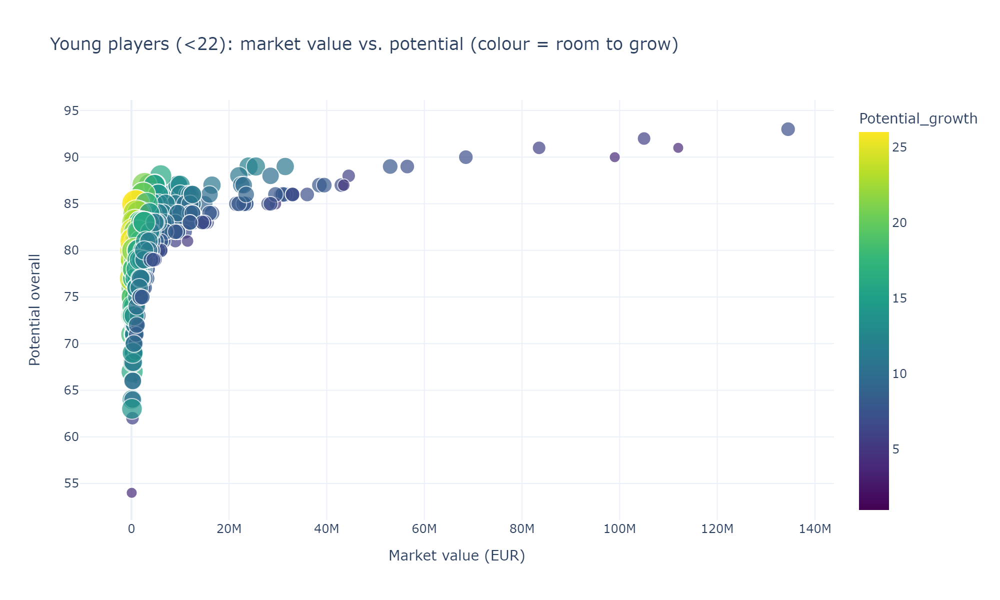

# Football (Soccer) Players — Talent Scout Analysis

## Project summary

This project analyzes a dataset of football (soccer) players — market value, nationality, position,
age, overall & potential rating, contract dates, wage and total stats — from the perspective of a
**talent scout** whose job is to recommend high-potential players to partner clubs at the best possible
price. The dataset mixes numerical, categorical and textual fields, which required real cleaning:
extracting contract **years** from messy text (`"2022 "`, `"Free"`, `"Jun 30, 2024"`), parsing the
multi-valued `Positions` column into a primary position and a broad category, and handling missing values,
duplicates and outliers. Using exploratory and comparative analysis in Pandas and interactive Plotly
visualizations, the notebook answers three questions: how position relates to price, which high-potential
players have contracts nearing expiration, and which young players offer high potential at a low price.
The result is a set of actionable, data-driven signings a scout can take to clubs.

## Research questions

1. **Position vs. price** — the relationship between a player's position and his market value.
2. **Contracts nearing expiration** — high-potential players whose contracts are close to expiring.
3. **Young bargains** — the youngest players who combine high potential with a low market price.

## Key findings

- **Attacking positions cost the most.** Forwards and midfielders carry the highest median market value;
  defenders sit in the middle and goalkeepers are the cheapest — so budget clubs get more rating per euro
  from defensive positions.
- **Value is driven mainly by current `Overall` rating and `Wage`**, while `Potential_overall` is only
  partly priced in — that gap is where bargains live.
- **Expiring contracts are leverage.** A shortlist of high-potential players (`Potential > 85`) have
  contracts ending in 2023/2024, giving clubs little pricing power.
- **Young bargains exist.** A ranked shortlist of players under 22 combine high potential, a large
  current-to-potential growth gap, and a value under €10M.

## Most impressive graph

Young players (under 22): market value vs. potential, colored by how much room they have to grow.
The most attractive prospects sit in the **top-left** (high potential, low price) and are the **brightest**
(biggest gap between current and potential rating).

## Dataset

- Kaggle dataset: <!-- TODO: paste the public Kaggle dataset URL here -->
- The CSV used is included in this repository: [`data/playr soccer trending.csv`](data/playr%20soccer%20trending.csv)

## Repository contents

- `EDA.ipynb` — the full analysis notebook (data cleaning, EDA, advanced analysis, and final report).
- `data/playr soccer trending.csv` — the dataset.
- `assets/` — exported graphs used in this README.

## How the DataCamp learning helped

The DataCamp courses gave me the Pandas foundation to clean genuinely messy real-world data — extracting
years from inconsistent contract text, splitting multi-valued position strings, and handling missing
values, duplicates and outliers with confidence. The data-visualization lessons made it natural to reach
for the right chart (box plots for comparing groups, scatter plots for spotting value opportunities, and a
correlation heatmap) and to read the story in the data. Most importantly, the courses taught me to frame an
analysis around a stakeholder's questions and turn statistics into clear, actionable recommendations.
